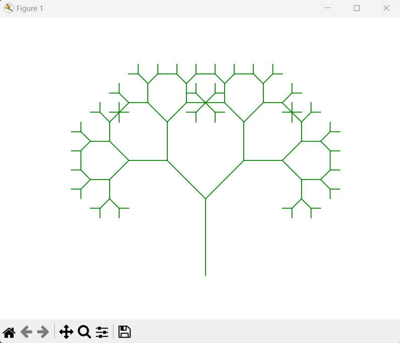
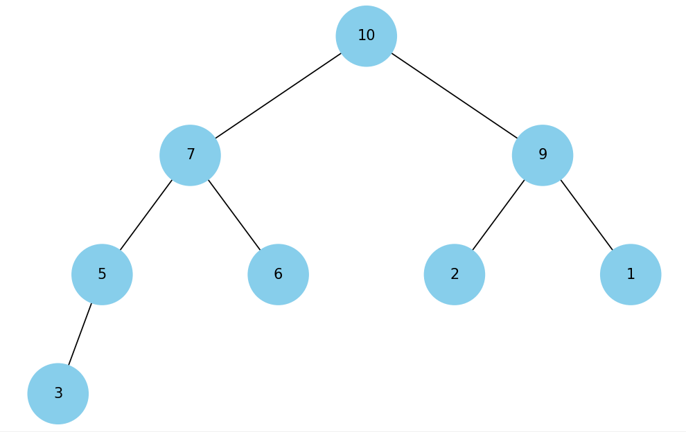
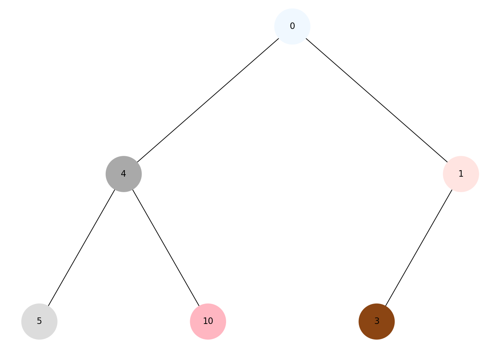
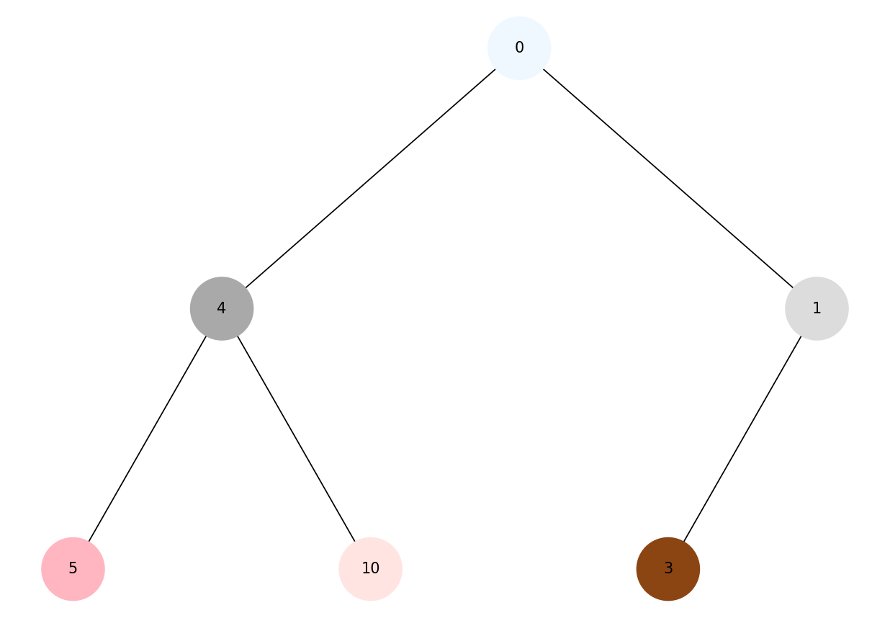
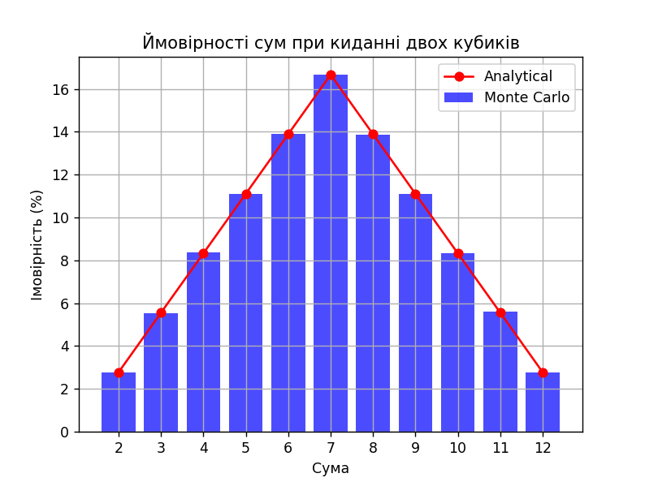

# goit-algo-fp

### Завдання 1

Original list:
3 -> 1 -> 2 -> 4 -> None
Reversed list:
4 -> 2 -> 1 -> 3 -> None
Sorted list:
1 -> 2 -> 3 -> 4 -> None
Merged sorted lists:
1 -> 2 -> 3 -> 4 -> 5 -> 6 -> None

### Завдання 2

Рівень рекурсії = 7:

### Завдання 3

Відстані від стартової вершини:
Від A до A: 0
Від A до B: 1
Від A до C: 3
Від A до D: 4

Попередники для побудови шляхів:
Вершина: A, Попередник: None
Вершина: B, Попередник: A
Вершина: C, Попередник: B
Вершина: D, Попередник: C

### Завдання 4

### Завдання 5

Візуалізація обходу в глубину:

Візуалізація обходу в ширину:

### Завдання 6

Жадібний алгоритм:
Обрані страви: ['cola', 'potato', 'pepsi', 'hot-dog']
Загальна калорійність: 870
Загальна вартість: 80

Динамічне програмування:
Обрані страви: ['potato', 'cola', 'pepsi', 'pizza']
Загальна калорійність: 970
Загальна вартість: 100

### Завдання 7

Сума    Імовірність (Монте-Карло)       Імовірність (Аналітична)
2       2.78%                   2.78%
3       5.53%                   5.56%
4       8.36%                   8.33%
5       11.09%                  11.11%
6       13.90%                  13.89%
7       16.66%                  16.67%
8       13.86%                  13.89%
9       11.10%                  11.11%
10      8.35%                   8.33%
11      5.59%                   5.56%
12      2.77%                   2.78%

#### Аналіз результатів:

1. Всі відхилення знаходяться в межах 0.01-0.03%, що є дуже малими відхиленнями для методу Монте-Карло. Це вказує на високу точність симуляції.
2. Відхилення не мають систематичного характеру (тобто не всі значення Монте-Карло більші або менші за аналітичні). Це означає, що симуляція добре відтворює випадковість процесу.
3. Виконання 1,000,000 кидків забезпечує достатню статистичну значимість для точного оцінювання ймовірностей. Великі кількості випробувань допомагають зменшити випадкові похибки.

#### Висновок:

Результати, отримані методом Монте-Карло, дуже близькі до аналітичних розрахунків. Це свідчить про правильність і надійність симуляції. Метод Монте-Карло добре підходить для оцінки ймовірностей у таких задачах, особливо коли виконуються велика кількість випробувань. Виконана симуляція підтверджує теоретичні ймовірності, демонструючи високу точність та ефективність методу.

Для ще більшої точності можна збільшити кількість симуляцій, але 1,000,000 випробувань вже забезпечують достатньо точний результат.
